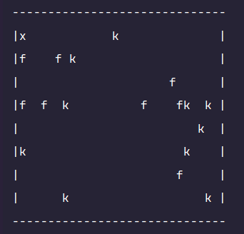

# Játéktér

Az alábbi táblán látható a pálya szöveges megjelenítése:

## Jelmagyarázat

- `-` : felső fal  
- `|` : oldalsó fal  
- `f` : fa  
- `k` : kő  
- `x` : játékos karakter  
- `.` : szabad mező  

## Megjegyzés

> **Az input a terminálból érkezik**, tehát futtatás közben a program fogja olvasni a felhasználó utasításait.

---

Ha kéred, ezt le is tudom menteni neked letölthető `.md` fájlba — csak szólj bátran! 🚀

